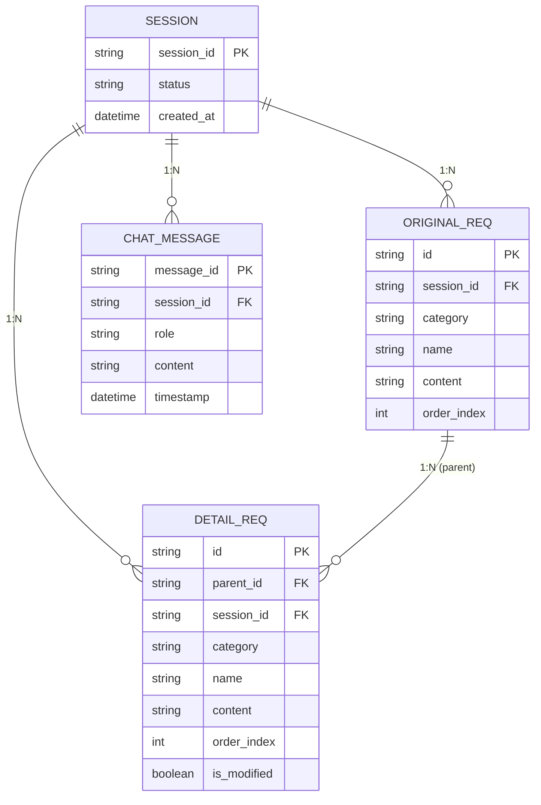

# REQ-ALL 데이터 설계

> 작성일: 2026-04-01
> Gate 2b — DBA 에이전트 작성
> 대상 요구사항: REQ-001 ~ REQ-006 전체

---

## 1. 영속성 전략 판단

### 결론: 인메모리(서버 세션) 채택, DB 불필요

#### 근거

| 판단 기준 | 분석 |
|----------|------|
| 사용자 수 | 단일 사용자 세션 기반 (REQ-006-04) |
| 데이터 생명주기 | 업로드 → 파싱 → AI생성 → 수정 → 다운로드의 **단일 세션 흐름** |
| 영속성 요구 | 세션 종료(페이지 새로고침, 브라우저 닫기) 후 데이터 복구 요건 없음 |
| 원본 파일 보관 | HWP 원본은 파싱 완료 후 즉시 삭제 (REQ-006-03) |
| 조회 복잡도 | 복잡한 JOIN, 집계 쿼리 없음. 단순 목록 + 계층 구조 |
| 동시성 | 단일 사용자, 동시 요청 없음 |

#### 인메모리 선택 이유

- **세션 범위 데이터**: 모든 데이터는 한 번의 HWP 업로드 세션에만 유효하다. 사용자가 새 파일을 올리면 이전 데이터는 폐기한다.
- **다운로드가 최종 산출물**: 영속화의 목적은 엑셀 파일로 이미 달성된다. DB는 중간 매개체일 뿐이다.
- **배포 단순성**: 로컬 실행 우선(REQ-006) 환경에서 DB 의존성은 불필요한 운영 비용이다.
- **파일 임시성**: HWP 원본조차 삭제하는 설계 방침이 데이터 비영속성 의도를 명확히 드러낸다.

#### DB가 필요해지는 조건 (미래 확장 시점)

- 여러 세션에 걸쳐 작업을 저장하고 재개하는 기능 추가 시
- 멀티 사용자 / 팀 협업 기능 추가 시
- 생성 이력 / 버전 관리 기능 추가 시

---

## 2. 데이터 모델 (Pydantic 스키마)

서버 인메모리 상태는 FastAPI 프로세스 수명과 동일하게 유지된다. 아래 모델은 서버 측 Python 타입(Pydantic v2)과 API 응답 구조를 동시에 정의한다.

### 2.1 ERD (논리 모델)



### 2.2 SessionState — 최상위 인메모리 컨테이너

```python
# app/models/session.py

from pydantic import BaseModel, Field
from typing import Literal
from datetime import datetime
import uuid

class SessionState(BaseModel):
    """서버 프로세스 수명 동안 유지되는 단일 세션 상태."""
    session_id: str = Field(default_factory=lambda: str(uuid.uuid4()))
    status: Literal["idle", "parsed", "generated", "done"] = "idle"
    original_requirements: list["OriginalRequirement"] = []
    detail_requirements: list["DetailRequirement"] = []
    chat_messages: list["ChatMessage"] = []
    created_at: datetime = Field(default_factory=datetime.utcnow)
```

| 필드 | 타입 | 설명 |
|------|------|------|
| `session_id` | `str (UUID4)` | 세션 식별자 |
| `status` | `Literal` | `idle` → `parsed` → `generated` → `done` |
| `original_requirements` | `list[OriginalRequirement]` | HWP 파싱 결과 |
| `detail_requirements` | `list[DetailRequirement]` | AI 생성 + 수정 결과 |
| `chat_messages` | `list[ChatMessage]` | 채팅 대화 내역 |
| `created_at` | `datetime` | 세션 시작 시각 |

### 2.3 OriginalRequirement — 원본 요구사항

HWP 파싱 결과. REQ-001-02에서 정의한 4개 항목을 구조화한다.

```python
# app/models/requirement.py

class OriginalRequirement(BaseModel):
    """HWP 파싱으로 추출된 원본 요구사항 1건."""
    id: str                  # 예: "REQ-001"  (HWP 원문 ID 그대로)
    category: str            # 요구사항 분류  (예: "기능요구사항")
    name: str                # 요구사항 명칭
    content: str             # 요구사항 내용
    order_index: int         # 화면/엑셀 출력 순서 (0-based)
```

| 필드 | 타입 | 제약 | 설명 |
|------|------|------|------|
| `id` | `str` | 필수, 파싱 원문 그대로 | HWP 내 요구사항 ID |
| `category` | `str` | 필수 | 분류명 |
| `name` | `str` | 필수 | 요구사항 명칭 |
| `content` | `str` | 필수 | 요구사항 내용 |
| `order_index` | `int` | 0-based, 중복 불가 | 정렬 순서 |

### 2.4 DetailRequirement — 상세 요구사항

AI가 생성하고 사용자가 수정하는 하위 항목. 원본 1건에 대해 N개(REQ-002-02).

```python
class DetailRequirement(BaseModel):
    """AI 생성 상세요구사항 1건."""
    id: str                  # 예: "REQ-001-01"
    parent_id: str           # 예: "REQ-001"  (OriginalRequirement.id 참조)
    category: str            # 분류 (원본과 동일하거나 세분화 가능)
    name: str                # 상세 요구사항 명칭
    content: str             # 상세 요구사항 내용
    order_index: int         # 동일 parent 내 순서 (0-based)
    is_modified: bool = False  # 사용자가 채팅/인라인편집으로 수정 여부
```

| 필드 | 타입 | 제약 | 설명 |
|------|------|------|------|
| `id` | `str` | 필수, `{parent_id}-{NN}` 형식 | 상세 요구사항 ID |
| `parent_id` | `str` | 필수, OriginalRequirement.id 참조 | 부모 원본 요구사항 ID |
| `category` | `str` | 필수 | 분류명 |
| `name` | `str` | 필수 | 명칭 |
| `content` | `str` | 필수 | 내용 |
| `order_index` | `int` | parent 내 0-based | 정렬 순서 |
| `is_modified` | `bool` | 기본값 False | 수정 이력 표시 (UI 강조용, REQ-004-02) |

#### ID 채번 규칙

```
parent_id = "REQ-001"
첫 번째 상세 → id = "REQ-001-01"
두 번째 상세 → id = "REQ-001-02"
...
N번째 상세  → id = "REQ-001-{N:02d}"
```

AI 응답에 ID가 누락되거나 형식이 맞지 않는 경우, 서버에서 parent_id + 시퀀스로 재생성한다.

### 2.5 ChatMessage — 채팅 메시지

```python
class ChatMessage(BaseModel):
    """사용자-AI 채팅 메시지 1건."""
    message_id: str = Field(default_factory=lambda: str(uuid.uuid4()))
    role: Literal["user", "assistant"]
    content: str
    timestamp: datetime = Field(default_factory=datetime.utcnow)
```

| 필드 | 타입 | 제약 | 설명 |
|------|------|------|------|
| `message_id` | `str (UUID4)` | 자동 생성 | 메시지 식별자 |
| `role` | `Literal` | `user` 또는 `assistant` | 발화자 구분 |
| `content` | `str` | 필수 | 메시지 본문 |
| `timestamp` | `datetime` | 자동 생성 | 메시지 수신 시각 |

### 2.6 API 요청/응답 스키마

```python
# app/models/api.py

class ParseResponse(BaseModel):
    """HWP 파싱 완료 응답."""
    session_id: str
    requirements: list[OriginalRequirement]

class GenerateResponse(BaseModel):
    """AI 생성 완료 응답."""
    details: list[DetailRequirement]

class ChatRequest(BaseModel):
    """채팅 수정 요청."""
    message: str

class ChatResponse(BaseModel):
    """채팅 수정 응답."""
    assistant_message: str
    updated_details: list[DetailRequirement]   # 수정된 항목만 포함

class InlineEditRequest(BaseModel):
    """인라인 편집 요청 (REQ-003-03)."""
    detail_id: str
    field: Literal["name", "content", "category"]
    value: str
```

---

## 3. 엑셀 출력 컬럼 구조

### 3.1 1단계 다운로드 — 원본 요구사항만

파일명: `requirements_original_{YYYYMMDD_HHMMSS}.xlsx`
시트명: `원본요구사항`

| 열 | 헤더 | 매핑 필드 | 비고 |
|----|------|---------|------|
| A | 요구사항 ID | `OriginalRequirement.id` | |
| B | 분류 | `OriginalRequirement.category` | |
| C | 요구사항 명칭 | `OriginalRequirement.name` | |
| D | 요구사항 내용 | `OriginalRequirement.content` | 셀 줄바꿈 허용, 행 높이 자동 조정 |

```
행 1: 헤더 (굵게, 배경색 #4472C4, 글자색 흰색)
행 2~N: 데이터 (order_index 오름차순)
```

### 3.2 2단계 다운로드 — 원본 + 상세요구사항 통합

파일명: `requirements_full_{YYYYMMDD_HHMMSS}.xlsx`
시트명: `상세요구사항`

#### 레이아웃 방식: 인터리빙(Interleaving) — 원본 행 직후에 상세 행들을 배치

| 열 | 헤더 | 원본 행 값 | 상세 행 값 | 비고 |
|----|------|----------|----------|------|
| A | 구분 | `원본` | `상세` | 행 유형 식별 |
| B | 요구사항 ID | `OriginalRequirement.id` | `DetailRequirement.id` | |
| C | 상위 요구사항 ID | (빈 셀) | `DetailRequirement.parent_id` | 원본 행은 공란 |
| D | 분류 | `OriginalRequirement.category` | `DetailRequirement.category` | |
| E | 요구사항 명칭 | `OriginalRequirement.name` | `DetailRequirement.name` | |
| F | 요구사항 내용 | `OriginalRequirement.content` | `DetailRequirement.content` | 셀 줄바꿈 허용 |

```
행 1   : 헤더 (굵게, 배경색 #4472C4, 글자색 흰색)
원본 행: 배경색 #D9E1F2 (연한 파랑)
상세 행: 배경색 흰색, D~F 열 좌측 들여쓰기 2칸
수정된 상세 행(is_modified=True): 배경색 #FFF2CC (연한 노랑) — 수정 식별 용이
```

#### 행 배치 예시

```
행 1:  헤더
행 2:  원본  | REQ-001 |          | 기능 | 파일 업로드 | 사용자는 HWP 파일을...
행 3:  상세  | REQ-001-01 | REQ-001 | 기능 | 파일 선택 UI | 드래그앤드롭 영역을...
행 4:  상세  | REQ-001-02 | REQ-001 | 기능 | 업로드 진행 표시 | 로딩 인디케이터를...
행 5:  원본  | REQ-002 |          | 기능 | AI 생성 | ...
행 6:  상세  | REQ-002-01 | REQ-002 | 기능 | ...
...
```

### 3.3 공통 엑셀 포맷 규칙

| 항목 | 규칙 |
|------|------|
| 파일 형식 | `.xlsx` (openpyxl 라이브러리) |
| 인코딩 | UTF-8 (openpyxl 기본) |
| 헤더 행 고정 | `freeze_panes = "A2"` |
| 내용 열 너비 | A:8, B:15, C:15, D:12, E:30, F:60 (문자 단위) |
| 셀 줄바꿈 | 내용 컬럼(`content`)에 `wrap_text=True` |
| 행 높이 | 내용 컬럼 기준 자동 조정 |
| 다운로드 방식 | FastAPI `StreamingResponse`, `Content-Disposition: attachment` |

---

## 4. 인메모리 상태 관리 설계

### 4.1 서버 측 싱글턴 패턴

```python
# app/state.py

from app.models.session import SessionState

# 단일 사용자 전제 — 프로세스 전역 상태
_session: SessionState | None = None

def get_session() -> SessionState:
    global _session
    if _session is None:
        _session = SessionState()
    return _session

def reset_session() -> SessionState:
    """새 HWP 업로드 시 상태 초기화."""
    global _session
    _session = SessionState()
    return _session
```

### 4.2 상태 전이

```
idle
  ↓ POST /parse (HWP 업로드 + 파싱 완료)
parsed
  ↓ POST /generate (AI 생성 완료)
generated
  ↓ POST /chat 또는 PATCH /details/{id} (수정)
generated  (수정은 상태 변경 없이 데이터만 갱신)
  ↓ GET /download/step1 또는 GET /download/step2
done  (다운로드 후에도 상태 유지, 추가 수정 가능)
```

### 4.3 세션 초기화 조건

| 트리거 | 동작 |
|--------|------|
| 새 HWP 파일 업로드 (`POST /parse`) | `reset_session()` 호출 후 파싱 시작 |
| 서버 재시작 | 프로세스 전역 변수 소멸 → 자동 초기화 |
| 명시적 초기화 API (`POST /reset`) | `reset_session()` 호출 (선택적 구현) |

---

## 5. 마이그레이션 스크립트

**해당 없음.**

본 설계는 인메모리 전략을 채택하므로 데이터베이스 마이그레이션 스크립트가 존재하지 않는다. 스키마 변경은 Pydantic 모델 수정으로 처리되며, 서버 재시작 시 자동으로 적용된다.

---

## 6. Breaking Change

현재 최초 설계이므로 기존 스키마 대비 Breaking Change가 없다.

향후 변경 시 주의가 필요한 항목은 아래와 같다.

| 변경 시나리오 | 영향 범위 | 대응 방안 |
|-------------|----------|----------|
| `DetailRequirement`에 필드 추가 | API 응답 스키마 변경 → 프론트엔드 파싱 수정 필요 | Pydantic `default` 값 설정으로 하위 호환 유지 |
| `id` 채번 규칙 변경 | 엑셀 ID 형식 변경 → 기존 다운로드 파일과 불일치 | 인메모리이므로 세션 내 일관성만 보장하면 충분 |
| DB 도입 결정 | 인메모리 → DB 전환 | `app/state.py`의 저장소 레이어만 교체. 모델 변경 최소화를 위해 Pydantic 모델을 ORM 모델과 분리 유지 |
| 다중 사용자 지원 | 세션 싱글턴 → 사용자별 세션 격리 필요 | `session_id`를 쿠키/헤더로 관리하도록 확장. 현재 모델에 이미 `session_id` 필드 보유 |

---

## 7. 파일 구조 참조

```
backend/
└── app/
    ├── models/
    │   ├── session.py       # SessionState
    │   ├── requirement.py   # OriginalRequirement, DetailRequirement
    │   └── api.py           # 요청/응답 스키마
    ├── state.py             # 인메모리 싱글턴 관리
    └── services/
        └── excel.py         # 엑셀 생성 로직 (openpyxl)
```
