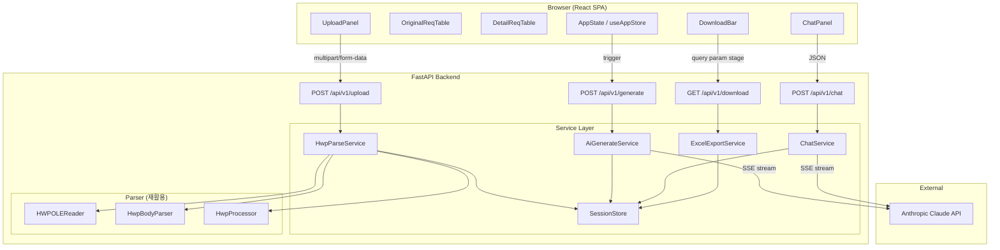

# REQ-001~006 통합 설계 문서

> 생성일: 2026-04-01
> Gate 2a — Architect 에이전트 작성

---

## 개요

- **REQ 그룹**: REQ-001~006 — HWP 제안요구사항 → 상세요구사항 자동생성 도구 전체
- **설계 방식**: Layered Architecture (Presentation → API → Service → Parser/AI)
- **핵심 결정사항**: 단일 세션 인메모리 상태 관리를 채택하여 DB를 배제한다. 사용자 1인이 한 세션에서 업로드-파싱-생성-수정-다운로드를 완결하는 것이 유일한 사용 패턴이므로, 서버 프로세스 내 메모리(`session_store` dict)로 충분하다. 영속성이 필요해지는 시점(다중 사용자, 이력 관리)에 SQLite 또는 PostgreSQL로 교체할 수 있도록 `SessionStore` 인터페이스를 추상화한다.

---

## Gate 1 미정 사항 결정

| 항목 | 결정 | 근거 |
|------|------|------|
| 데이터베이스 | 인메모리 (서버 측 dict) | 단일 사용자 단일 세션, 영속성 불필요. `SessionStore` 추상화로 교체 가능하게 설계 |
| AI 스트리밍 | Server-Sent Events (SSE) 스트리밍 채택 | AI 생성에 수십 초 소요 예상. 일괄 응답 시 UX 불량. REQ-002-03, REQ-003-02가 진행 중 표시를 요구 |
| 배포 환경 | 로컬 실행 우선, Docker-Compose 구성 준비 | Gate 1 결정 유지. `docker-compose.yml` 파일을 준비하되 기본 실행은 로컬 직접 실행 |
| 엑셀 컬럼 구조 | 원본/상세 동일 구조 사용, 계층 구분 컬럼 추가 | 하단 "엑셀 출력 스펙" 참조 |

---

## 시스템 구조



---

## 데이터 흐름

각 단계에서 주고받는 데이터 형태를 정의한다.

### 1단계: 업로드 → 파싱

```
클라이언트  →  [multipart/form-data: file=*.hwp]  →  /api/v1/upload
서버 내부:
  임시 파일 저장 → HWPOLEReader.open() → get_bodytext_streams()
  → 각 스트림 HwpBodyParser.extract_all() → HwpProcessor 집계
  → 임시 파일 삭제
  → SessionStore에 OriginalRequirement[] 저장

서버  →  클라이언트 응답:
{
  "session_id": "uuid-v4",
  "requirements": [
    {
      "id": "REQ-001",
      "category": "기능",
      "name": "사용자 인증",
      "content": "..."
    }
  ]
}
```

### 2단계: AI 생성 (SSE 스트리밍)

```
클라이언트  →  [POST /api/v1/generate body: {session_id}]
서버:
  SessionStore에서 OriginalRequirement[] 조회
  → 프롬프트 조립 (시스템 프롬프트 + 원본 요구사항 JSON 직렬화)
  → Claude API messages.stream() 호출
  → 응답 청크를 파싱하여 JSON 완성 시점 감지

클라이언트로 SSE 이벤트:
  data: {"type": "item", "data": {"parent_id":"REQ-001", "id":"REQ-001-01", "category":"기능", "name":"...", "content":"..."}}
  data: {"type": "item", "data": {...}}
  data: {"type": "done", "total": 42}
  data: {"type": "error", "message": "..."}
```

### 3단계: 채팅 수정 (SSE 스트리밍)

```
클라이언트  →  [POST /api/v1/chat body: {session_id, message, history:[]}]
서버:
  현재 DetailRequirement[] 컨텍스트 + 채팅 이력을 프롬프트에 포함
  → Claude API 호출 (채팅 모드)
  → 응답에서 수정 대상 ID와 새 내용을 파싱

클라이언트로 SSE 이벤트:
  data: {"type": "text", "delta": "네, REQ-001-02의 내용을 ..."}    ← 채팅 텍스트 스트림
  data: {"type": "patch", "id": "REQ-001-02", "field": "content", "value": "새 내용"}  ← 테이블 패치
  data: {"type": "done"}
```

### 4단계: 다운로드

```
클라이언트  →  GET /api/v1/download?session_id=...&stage=1|2
서버:
  stage=1: OriginalRequirement[]만 엑셀 변환
  stage=2: OriginalRequirement[] + DetailRequirement[] 병합 후 엑셀 변환
  → .xlsx 바이너리 스트리밍 응답

응답 헤더:
  Content-Type: application/vnd.openxmlformats-officedocument.spreadsheetml.sheet
  Content-Disposition: attachment; filename="requirements-{stage}.xlsx"
```

---

## 엑셀 출력 스펙

두 단계 다운로드 모두 동일 컬럼 구조를 사용하며, `type` 컬럼으로 원본/상세를 구분한다.

| 컬럼명 | 내용 | 비고 |
|--------|------|------|
| type | `original` / `detail` | 행 유형 구분 |
| id | REQ-001 / REQ-001-01 | 계층 ID |
| parent_id | REQ-001 (detail인 경우) | 원본은 빈 값 |
| category | 요구사항 분류 | |
| name | 요구사항 명칭 | |
| content | 요구사항 내용 | |

원본 행 다음에 해당 원본의 상세 행들을 연속 배치한다. 1단계 다운로드는 `type=original` 행만 포함한다.

---

## 모듈/컴포넌트 설계

### 백엔드

#### `app/parser/hwp_ole_reader.py` (재활용)
- **책임**: HWP OLE2 컨테이너에서 BodyText 스트림 바이너리를 추출
- **인터페이스**: `HWPOLEReader(file_path: str)` — `open()`, `get_bodytext_streams() -> list[str]`, `get_stream_data(stream_name: str) -> bytes`, `close()`
- **제약**: 파일 경로 기반 인터페이스이므로 바이트 입력 지원 불가 — 업로드된 파일은 반드시 임시 경로에 저장 후 전달해야 함. `open()` 호출 시 OLE2 매직 바이트 + FileHeader 스트림 존재 여부로 HWP 파일을 검증함(기존 구현 활용)
- **결정 근거**: REQ-001-03, REQ-006-02에 따라 신규 파싱 코드를 작성하지 않고 그대로 재활용

#### `app/parser/hwp_body_parser.py` (재활용)
- **책임**: BodyText 스트림 바이너리를 디코드하여 텍스트와 표 구조를 추출
- **인터페이스**: `HwpBodyParser()` — `extract_all(stream_data: bytes) -> List[Dict]`
- **반환 형태**: `[{"type": "text"|"table", "content"|"data": ...}]`
- **제약**: 압축(zlib deflate) 해제를 내부에서 수행함. 표는 행/열/셀 구조로 반환되므로, 요구사항 테이블 인식은 상위 `HwpProcessor`에서 담당

#### `app/parser/hwp_processor.py`
- **책임**: `HWPOLEReader` + `HwpBodyParser` 조합으로 HWP 파일을 처리하고, 요구사항 ID/분류/명칭/내용 4개 항목을 추출하여 `OriginalRequirement` 리스트로 변환
- **인터페이스**: `HwpProcessor` — `process(file_path: str) -> list[OriginalRequirement]`
- **내부 흐름**: OLE 열기 → BodyText 스트림 순회 → 각 스트림 `extract_all()` → 표(table) 타입 항목에서 열 구조 추론하여 ID/분류/명칭/내용 매핑
- **제약**: 기존 project-mgmt 코드에 `process_file()` 메서드가 DataFrame을 반환하는 형태가 있으나, 본 프로젝트에서는 DataFrame 의존성 없이 순수 Python 객체로 반환하도록 어댑터 계층(`HwpProcessor`)을 신규 작성한다. 기존 파서 클래스 자체는 수정하지 않는다
- **결정 근거**: pandas 의존성을 백엔드에 추가하지 않기 위함. UT-001-03이 이 어댑터를 주요 단위 테스트 대상으로 삼는다

#### `app/services/hwp_parse_service.py`
- **책임**: 업로드 파일의 임시 저장, HwpProcessor 호출, 결과 SessionStore 저장, 임시 파일 정리
- **인터페이스**: `HwpParseService` — `parse(file_bytes: bytes, filename: str) -> ParseResult`
- **반환**: `ParseResult(session_id: str, requirements: list[OriginalRequirement])`
- **제약**: 임시 파일은 `tempfile.NamedTemporaryFile`을 사용하여 처리 완료(성공/실패 모두) 후 삭제한다(REQ-006-03). 파싱 실패 시 `HwpParseError`를 발생시키고 API 계층에서 400 응답으로 변환한다
- **파일 유효성 선검증**: `.hwp` 확장자 검사 및 `olefile.isOleFile()` 검사를 HWPOLEReader 호출 전에 서비스 계층에서 수행하여 빠른 실패(fail-fast) 처리

#### `app/services/ai_generate_service.py`
- **책임**: SessionStore에서 원본 요구사항을 읽어 Claude API에 전달하고, 스트리밍 응답을 파싱하여 `DetailRequirement` 항목을 SSE로 클라이언트에 전송, 완성된 목록을 SessionStore에 저장
- **인터페이스**: `AiGenerateService` — `generate_stream(session_id: str) -> AsyncGenerator[str, None]`
- **반환**: SSE 이벤트 문자열 제너레이터 (FastAPI `StreamingResponse`에 전달)
- **제약**: Claude SDK `messages.stream()` 컨텍스트 매니저 사용. 응답 형식은 JSON 배열 — 프롬프트에서 JSON만 반환하도록 명시하고, 스트리밍 청크를 누적하여 완전한 JSON 파싱 시점에 `item` 이벤트를 발행한다
- **오류 처리**: `anthropic.APIError`, `anthropic.RateLimitError` 등 SDK 예외를 캐치하여 `error` 타입 SSE 이벤트로 변환

#### `app/services/chat_service.py`
- **책임**: 채팅 메시지와 현재 상세요구사항 컨텍스트를 결합하여 Claude API에 전달하고, 응답에서 테이블 패치 명령과 채팅 텍스트를 분리하여 SSE 전송, SessionStore의 DetailRequirement 업데이트
- **인터페이스**: `ChatService` — `chat_stream(session_id: str, message: str, history: list[ChatMessage]) -> AsyncGenerator[str, None]`
- **제약**: 채팅 히스토리는 클라이언트가 유지하고 매 요청 시 전송한다 — 서버는 히스토리를 저장하지 않는다. Claude API `messages` 파라미터에 히스토리를 직접 전달한다
- **결정 근거**: 서버 측 히스토리 저장을 생략하면 SessionStore 구조가 단순해지고, 세션 만료 문제가 없다. 클라이언트가 히스토리를 보유하므로 상태는 브라우저 메모리에 있다

#### `app/services/excel_export_service.py`
- **책임**: SessionStore의 데이터를 `openpyxl`로 엑셀 파일 바이너리로 변환
- **인터페이스**: `ExcelExportService` — `export(session_id: str, stage: Literal[1, 2]) -> bytes`
- **제약**: `stage=1`은 원본 요구사항만, `stage=2`는 원본 + 상세 요구사항을 포함. 상세요구사항 미생성 상태에서 `stage=2` 요청 시 422 오류를 반환한다

#### `app/services/session_store.py`
- **책임**: 세션 ID를 키로 파싱 결과와 AI 생성 결과를 인메모리에 보관
- **인터페이스**:
  ```
  SessionStore
    get_session(session_id: str) -> Session | None
    create_session() -> str  # 새 UUID 반환
    set_original(session_id: str, reqs: list[OriginalRequirement]) -> None
    get_original(session_id: str) -> list[OriginalRequirement]
    set_detail(session_id: str, reqs: list[DetailRequirement]) -> None
    get_detail(session_id: str) -> list[DetailRequirement]
    patch_detail(session_id: str, req_id: str, field: str, value: str) -> None
  ```
- **제약**: 인메모리 구현이므로 서버 재시작 시 데이터 소실. 단일 프로세스 가정이므로 스레드 안전성을 위해 `threading.Lock` 사용. 세션 TTL은 구현하지 않는다 (단기 사용 목적)
- **결정 근거**: 본 도구는 단일 사용자가 단일 세션을 사용하는 것을 전제로 하므로 DB 불필요. `SessionStore` 인터페이스를 추상화하여 향후 SQLite 교체 시 서비스 계층 코드 변경 최소화

#### `app/models/schemas.py`
- **책임**: API 요청/응답 및 내부 데이터 모델 정의
- **주요 타입**:
  ```
  OriginalRequirement(id, category, name, content)
  DetailRequirement(id, parent_id, category, name, content)
  ParseResult(session_id, requirements: list[OriginalRequirement])
  ChatMessage(role: "user"|"assistant", content: str)
  ChatRequest(session_id, message, history: list[ChatMessage])
  GenerateRequest(session_id)
  DownloadStage = Literal[1, 2]
  ```
- **제약**: Pydantic v2 `BaseModel` 사용. FastAPI 라우터에서 직접 참조

---

### 프론트엔드 컴포넌트

#### `useAppStore` (Zustand 전역 스토어)
- **책임**: 세션 ID, 원본 요구사항 목록, 상세요구사항 목록, 채팅 히스토리, UI 상태(로딩 플래그, 에러 메시지)를 전역 관리
- **공개 인터페이스**:
  ```
  state:
    sessionId: string | null
    originalReqs: OriginalRequirement[]
    detailReqs: DetailRequirement[]
    chatHistory: ChatMessage[]
    isUploading: boolean
    isGenerating: boolean
    isChatting: boolean
    error: string | null
  actions:
    setSessionId(id: string): void
    setOriginalReqs(reqs: OriginalRequirement[]): void
    appendDetailReq(req: DetailRequirement): void
    patchDetailReq(id: string, field: string, value: string): void
    appendChatMessage(msg: ChatMessage): void
    setError(msg: string | null): void
  ```
- **제약**: Zustand `persist` 미사용 — 페이지 새로고침 시 상태 초기화는 허용된 동작 (REQ-006-04는 페이지 새로고침 없이 완결을 요구하므로 충분)
- **결정 근거**: 컴포넌트 간 깊은 props drilling을 방지하기 위해 전역 스토어 채택. Context API 대비 Zustand는 불필요한 리렌더링이 적음

#### `UploadPanel`
- **책임**: HWP 파일 드래그앤드롭/선택 UI, 업로드 버튼, 업로드 진행 인디케이터
- **인터페이스**: `<UploadPanel />`  (props 없음, 스토어 직접 접근)
- **제약**: 파일 선택 직후 확장자 검증(.hwp)을 클라이언트에서 선행 — 잘못된 파일 타입을 서버 전송 전에 차단. `isUploading` 상태 동안 버튼 비활성화
- **에러 처리**: 서버 400 응답 시 `setError(message)`로 인라인 에러 표시

#### `OriginalReqTable`
- **책임**: 원본 요구사항 4컬럼(ID/분류/명칭/내용) 표시 전용 읽기 테이블
- **인터페이스**: `<OriginalReqTable rows={OriginalRequirement[]} />`
- **제약**: 편집 불가 — 원본 데이터는 수정하지 않는다는 UX 원칙. 데이터 없을 때 빈 상태 메시지 표시

#### `DetailReqTable`
- **책임**: 상세요구사항 표시 및 인라인 편집. AI 생성 중 행 동적 추가. 채팅 수정으로 변경된 행 하이라이트
- **인터페이스**: `<DetailReqTable />`  (스토어 직접 접근)
- **인라인 편집**: 셀 클릭 시 `<input>` 또는 `<textarea>`로 전환, blur 이벤트에서 `patchDetailReq()` 호출
- **하이라이트**: 채팅 패치로 변경된 행은 3초간 배경색 강조 후 원복
- **제약**: `isGenerating` 상태 동안 편집 기능 비활성화 — 생성 중 편집 충돌 방지

#### `ChatPanel`
- **책임**: 채팅 메시지 입력, 전송, 히스토리 표시, AI 응답 스트리밍 표시
- **인터페이스**: `<ChatPanel />`  (스토어 직접 접근)
- **제약**: `sessionId`가 없거나 `detailReqs`가 비어 있을 때 입력창 비활성화 — 상세요구사항 생성 전 채팅 방지. 전송 중(`isChatting`) 재전송 방지
- **히스토리**: 스크롤 컨테이너 내에서 최신 메시지로 자동 스크롤

#### `DownloadBar`
- **책임**: 1단계/2단계 다운로드 버튼 표시 및 클릭 시 파일 다운로드 트리거
- **인터페이스**: `<DownloadBar />`  (스토어 직접 접근)
- **제약**: 1단계 버튼은 `originalReqs`가 있을 때만 활성화. 2단계 버튼은 `detailReqs`가 있을 때만 활성화. 다운로드는 `window.location.href` 또는 `<a download>` 태그를 통한 GET 요청으로 처리 — Blob 다운로드 방식과 달리 메모리 부담 없음

#### `api.ts` (API 클라이언트 모듈)
- **책임**: 백엔드 REST API 호출 함수와 SSE 연결 헬퍼를 제공
- **인터페이스**:
  ```
  uploadHwp(file: File): Promise<ParseResult>
  generateDetailStream(sessionId: string, callbacks: {onItem, onDone, onError}): () => void
  chatStream(req: ChatRequest, callbacks: {onText, onPatch, onDone, onError}): () => void
  getDownloadUrl(sessionId: string, stage: 1|2): string
  ```
- **제약**: SSE 헬퍼는 `EventSource` 대신 `fetch` + `ReadableStream`을 사용한다 — POST 요청 바디 전달이 필요하기 때문에 `EventSource`(GET 전용)를 사용할 수 없음. 반환값은 연결 해제 함수(cleanup)

---

## Claude API 연동 방식

### 상세요구사항 생성 프롬프트 전략

**시스템 프롬프트 방침**:
- 역할: 공공/기업 제안 업무 전문가
- 출력 형식: JSON 배열만 반환 (마크다운 코드 블록 없이 순수 JSON)
- 각 항목 구조: `{id, parent_id, category, name, content}`
- 명명 규칙: 원본 ID `REQ-001` → 상세 `REQ-001-01`, `REQ-001-02` ...
- 상세화 기준: 원본 요구사항 1건당 2~5개의 구현 가능한 단위 요구사항으로 분해

**사용자 메시지 구성**:
```
다음 원본 요구사항 목록을 상세요구사항으로 분해해주세요.
[원본 요구사항 JSON 배열]
```

**스트리밍 처리 방침**: Claude가 JSON 배열을 스트리밍으로 반환할 때 완전한 객체 경계(`}`)를 감지하여 항목 단위로 파싱한다. 불완전한 JSON 청크는 버퍼에 누적하다가 파싱 가능 시점에 `item` SSE 이벤트 발행.

### 채팅 수정 프롬프트 전략

**시스템 프롬프트 방침**:
- 현재 상세요구사항 전체를 컨텍스트로 제공
- 수정 요청 시 두 가지 출력을 함께 반환: (1) 채팅 응답 텍스트, (2) 수정 명령 JSON
- 수정 명령 형식: `<PATCH>{"id":"REQ-001-02","field":"content","value":"..."}</PATCH>` 태그로 감싸서 채팅 텍스트와 구분
- 수정 대상이 없는 일반 질문의 경우 PATCH 태그 없이 텍스트만 반환

**클라이언트 처리**: SSE 스트리밍 중 `<PATCH>` 태그 감지 시 `patch` 이벤트 발행, 나머지는 `text` 이벤트로 채팅창에 표시

---

## API 설계

| Method | Path | 설명 | 인증 | 요청 바디 | 응답 |
|--------|------|------|------|-----------|------|
| POST | /api/v1/upload | HWP 파일 업로드 및 파싱 | 없음 | `multipart/form-data: file` | `ParseResult` JSON |
| POST | /api/v1/generate | 상세요구사항 AI 생성 (SSE) | 없음 | `{"session_id": "..."}` | SSE 스트림 |
| POST | /api/v1/chat | 채팅 AI 수정 (SSE) | 없음 | `ChatRequest` JSON | SSE 스트림 |
| GET | /api/v1/download | 엑셀 다운로드 | 없음 | query: `session_id`, `stage=1\|2` | `.xlsx` 바이너리 |

### 에러 응답 형식 (공통)

```json
{
  "detail": {
    "code": "PARSE_ERROR | AI_ERROR | SESSION_NOT_FOUND | INVALID_STAGE | ...",
    "message": "사용자에게 표시할 메시지"
  }
}
```

HTTP 상태 코드 매핑:
- 400: 파싱 실패, 유효하지 않은 파일
- 404: 세션 없음
- 422: 요청 파라미터 오류 (FastAPI 기본)
- 500: 서버 내부 오류
- 503: Claude API 접속 불가

---

## 디렉토리 구조

```
extract-req/
├── frontend/                         # React 앱
│   ├── src/
│   │   ├── components/
│   │   │   ├── UploadPanel.tsx
│   │   │   ├── OriginalReqTable.tsx
│   │   │   ├── DetailReqTable.tsx
│   │   │   ├── ChatPanel.tsx
│   │   │   └── DownloadBar.tsx
│   │   ├── store/
│   │   │   └── useAppStore.ts        # Zustand 전역 상태
│   │   ├── api/
│   │   │   └── api.ts                # 백엔드 API 클라이언트
│   │   ├── types/
│   │   │   └── index.ts              # 공유 타입 정의
│   │   ├── App.tsx
│   │   └── main.tsx
│   ├── package.json
│   └── vite.config.ts
│
├── backend/                          # FastAPI 앱
│   ├── app/
│   │   ├── main.py                   # FastAPI 앱 인스턴스, CORS, 라우터 등록
│   │   ├── routers/
│   │   │   ├── upload.py             # POST /api/v1/upload
│   │   │   ├── generate.py           # POST /api/v1/generate
│   │   │   ├── chat.py               # POST /api/v1/chat
│   │   │   └── download.py           # GET /api/v1/download
│   │   ├── services/
│   │   │   ├── hwp_parse_service.py
│   │   │   ├── ai_generate_service.py
│   │   │   ├── chat_service.py
│   │   │   ├── excel_export_service.py
│   │   │   └── session_store.py
│   │   ├── parser/                   # 기존 파서 재활용 (복사 또는 심볼릭 링크)
│   │   │   ├── hwp_ole_reader.py     # ../project-mgmt/backend/app/parser/ 재활용
│   │   │   ├── hwp_body_parser.py    # ../project-mgmt/backend/app/parser/ 재활용
│   │   │   └── hwp_processor.py     # 신규 — 어댑터 계층
│   │   ├── models/
│   │   │   └── schemas.py
│   │   └── core/
│   │       ├── config.py             # 환경변수 (ANTHROPIC_API_KEY 등)
│   │       └── exceptions.py         # 커스텀 예외 클래스
│   ├── tests/
│   │   ├── unit/
│   │   │   ├── test_hwp_processor.py
│   │   │   ├── test_session_store.py
│   │   │   ├── test_ai_generate_service.py
│   │   │   └── test_excel_export_service.py
│   │   └── fixtures/
│   │       └── sample.hwp            # 테스트용 HWP 파일
│   ├── requirements.txt
│   └── .env.example
│
├── docs/
│   ├── 01-requirements/
│   │   └── REQUIREMENTS.md
│   └── 02-design/
│       └── req-all-design.md         # 이 파일
│
└── docker-compose.yml                # 로컬 실행 편의용 (선택)
```

---

## 단위 테스트 ID 사전 할당

| UT-ID | 대상 | 설명 | REQ-ID |
|-------|------|------|--------|
| UT-001-01 | `HWPOLEReader.open()` | 유효한 HWP 파일 — `True` 반환 | REQ-001-03 |
| UT-001-02 | `HWPOLEReader.open()` | OLE2가 아닌 파일 — `ValueError` 발생 | REQ-001-04 |
| UT-001-03 | `HWPOLEReader.open()` | FileHeader 누락 파일 — `ValueError` 발생 | REQ-001-04 |
| UT-001-04 | `HwpBodyParser.extract_all()` | 표 타입 항목이 있는 스트림 — `type: table` 포함 반환 | REQ-001-03 |
| UT-001-05 | `HwpBodyParser.extract_all()` | 텍스트만 있는 스트림 — `type: text` 항목만 반환 | REQ-001-03 |
| UT-001-06 | `HwpProcessor.process()` | 정상 HWP — `OriginalRequirement` 리스트 반환, 4개 필드 존재 | REQ-001-02 |
| UT-001-07 | `HwpProcessor.process()` | 표 구조가 비정형인 HWP — 빈 리스트 반환 (크래시 없음) | REQ-001-04 |
| UT-001-08 | `HwpParseService.parse()` | `.pdf` 파일 — `HwpParseError` 발생 | REQ-001-04 |
| UT-001-09 | `HwpParseService.parse()` | 처리 완료 후 임시 파일 삭제 확인 | REQ-006-03 |
| UT-002-01 | `AiGenerateService.generate_stream()` | Claude 응답 JSON 파싱 — `DetailRequirement` 항목 생성 | REQ-002-01 |
| UT-002-02 | `AiGenerateService.generate_stream()` | Claude `APIError` 발생 시 `error` SSE 이벤트 발행 | REQ-002-04 |
| UT-002-03 | `AiGenerateService.generate_stream()` | 존재하지 않는 세션 ID — `SessionNotFoundError` 발생 | REQ-002-01 |
| UT-002-04 | `AiGenerateService._parse_stream_chunk()` | 불완전한 JSON 청크 누적 후 완성 시 파싱 성공 | REQ-002-01 |
| UT-003-01 | `ChatService.chat_stream()` | PATCH 태그 포함 응답 — `patch` SSE 이벤트 발행 | REQ-004-02 |
| UT-003-02 | `ChatService.chat_stream()` | PATCH 태그 없는 응답 — `text` SSE 이벤트만 발행 | REQ-004-01 |
| UT-003-03 | `SessionStore.patch_detail()` | 존재하는 ID의 field 수정 — 값 변경 확인 | REQ-004-02 |
| UT-003-04 | `SessionStore.patch_detail()` | 존재하지 않는 ID — `KeyError` 발생 | REQ-004-02 |
| UT-004-01 | `SessionStore.create_session()` | 호출마다 고유 UUID 반환 | REQ-006-04 |
| UT-004-02 | `SessionStore.get_session()` | 존재하지 않는 세션 — `None` 반환 | REQ-006-04 |
| UT-004-03 | `SessionStore` (동시 접근) | 두 스레드가 동시에 `set_original()` 호출 — 데이터 손상 없음 | REQ-006-04 |
| UT-005-01 | `ExcelExportService.export()` | `stage=1` — 원본 요구사항만 포함된 `.xlsx` 반환 | REQ-005-01 |
| UT-005-02 | `ExcelExportService.export()` | `stage=2` — 원본 + 상세 요구사항 포함 `.xlsx` 반환 | REQ-005-02 |
| UT-005-03 | `ExcelExportService.export()` | `stage=2`, 상세요구사항 없음 — `422` 오류 | REQ-005-02 |
| UT-005-04 | `ExcelExportService.export()` | 엑셀 컬럼 헤더 검증 — `type, id, parent_id, category, name, content` 포함 | REQ-005-03 |
| UT-006-01 | `api.ts uploadHwp()` | 성공 응답 — `sessionId` 및 `requirements` 파싱 | REQ-001-01 |
| UT-006-02 | `api.ts uploadHwp()` | 400 응답 — 에러 메시지 반환 | REQ-001-04 |
| UT-006-03 | `api.ts generateDetailStream()` | `item` 이벤트 — `onItem` 콜백 호출 | REQ-002-01 |
| UT-006-04 | `api.ts generateDetailStream()` | `error` 이벤트 — `onError` 콜백 호출 | REQ-002-04 |
| UT-006-05 | `useAppStore.patchDetailReq()` | 존재하는 id 패치 — 해당 항목 field 값 변경 | REQ-004-02 |
| UT-006-06 | `useAppStore.patchDetailReq()` | 존재하지 않는 id 패치 — 다른 항목 불변 | REQ-004-02 |

---

## 보안 고려사항

| SEC-ID | 위협 | 대응 방안 | OWASP |
|--------|------|----------|-------|
| SEC-001-01 | 악성 HWP 파일 업로드 (경로 조작, zip-bomb 등) | 서버 수신 직후 확장자 검사(`.hwp`만 허용), OLE2 매직 바이트 검증, 파일 크기 상한 설정(권장: 50MB). `HWPOLEReader`의 기존 시그니처 검증 로직 활용 | A03: Injection |
| SEC-001-02 | 임시 파일 잔류로 인한 민감 정보 노출 | `try/finally`로 성공·실패 모든 경로에서 임시 파일 삭제 보장. `tempfile.NamedTemporaryFile(delete=False)` + 명시적 삭제 패턴 사용 | A02: Cryptographic Failures |
| SEC-001-03 | 파일 업로드를 통한 경로 탐색(Path Traversal) | `filename`을 파일 시스템에 직접 사용하지 않고, `uuid4()`로 생성한 이름을 임시 경로에 저장. 원본 파일명은 메타데이터로만 보관 | A03: Injection |
| SEC-002-01 | ANTHROPIC_API_KEY 노출 | 환경변수로만 관리, `.env` 파일을 `.gitignore`에 추가, `.env.example`에 키 자리표시자만 제공. 프론트엔드에는 API 키 전달 금지 | A02: Cryptographic Failures |
| SEC-002-02 | Claude API 응답을 통한 프롬프트 인젝션 | 사용자 입력을 Claude 프롬프트에 삽입 시 시스템 프롬프트와 사용자 메시지를 `messages` 배열의 별도 role로 분리. 시스템 프롬프트에서 역할 탈출을 명시적으로 금지하는 지침 포함 | A03: Injection |
| SEC-003-01 | CORS 미설정으로 인한 크로스 오리진 요청 허용 | FastAPI `CORSMiddleware`에서 `allow_origins`를 `http://localhost:5173`(개발) 등 명시적 오리진으로 제한. `allow_origins=["*"]` 금지 | A05: Security Misconfiguration |
| SEC-003-02 | 대용량 요청(DOS) | 파일 업로드 크기 제한(FastAPI `max_upload_size` 또는 Nginx 설정), 채팅 메시지 길이 제한(최대 2000자 권장), 히스토리 최대 턴 수 제한(최대 20턴 권장) | A05: Security Misconfiguration |
| SEC-004-01 | 세션 ID 추측 공격 | 세션 ID를 `uuid.uuid4()`로 생성하여 예측 불가 보장. 세션 ID는 응답 바디로만 전달하고 쿠키나 URL 파라미터에 평문 노출 최소화 | A07: Identification and Authentication Failures |
| SEC-005-01 | XSS — AI 응답 HTML 인젝션 | React는 기본적으로 JSX 내 문자열을 이스케이프하므로 `dangerouslySetInnerHTML` 미사용 시 안전. 채팅 응답과 테이블 셀 값을 텍스트 노드로만 렌더링 | A03: Injection |
