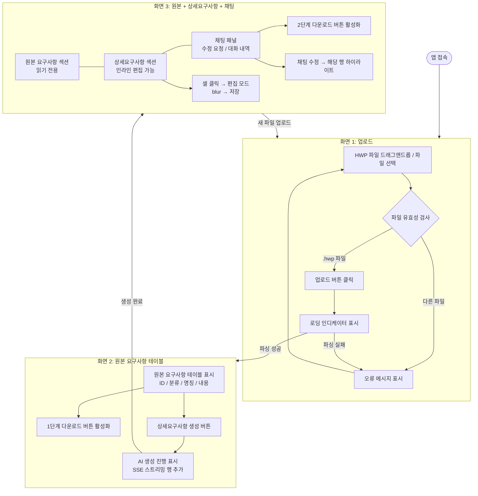
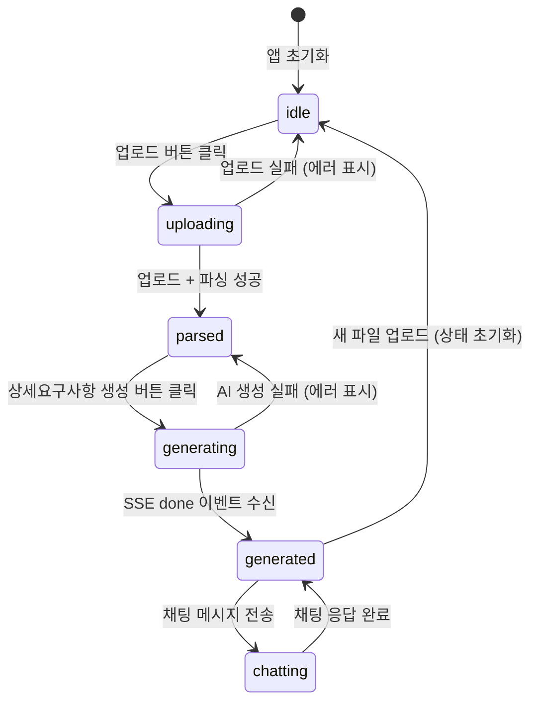

# UI 설계 문서

> 생성일: 2026-04-01
> Gate 2c — UI Designer 에이전트 작성

---

## 개요

HWP 제안요구사항 파일을 업로드하면 AI가 상세요구사항을 자동 생성하는 도구의 UI 설계 문서이다.
주 사용자는 제안팀/기획팀 담당자이며, 정보량이 많은 상황에서도 직관적으로 사용 가능해야 한다.

---

## 디자인 토큰

```json
{
  "color": {
    "primary": "#2563EB",
    "primary-hover": "#1D4ED8",
    "primary-light": "#EFF6FF",
    "secondary": "#6B7280",
    "success": "#10B981",
    "success-light": "#ECFDF5",
    "warning": "#F59E0B",
    "error": "#EF4444",
    "error-light": "#FEF2F2",
    "background": "#F8FAFC",
    "surface": "#FFFFFF",
    "surface-secondary": "#F1F5F9",
    "border": "#E2E8F0",
    "border-focus": "#2563EB",
    "text-primary": "#0F172A",
    "text-secondary": "#475569",
    "text-disabled": "#94A3B8",
    "row-original": "#FFFFFF",
    "row-original-header": "#F8FAFC",
    "row-detail": "#F0F9FF",
    "row-detail-header": "#E0F2FE",
    "row-highlight": "#FEF9C3"
  },
  "spacing": {
    "xs": "4px",
    "sm": "8px",
    "md": "16px",
    "lg": "24px",
    "xl": "32px",
    "2xl": "48px"
  },
  "radius": {
    "sm": "4px",
    "md": "8px",
    "lg": "12px",
    "xl": "16px",
    "full": "9999px"
  },
  "typography": {
    "heading-1": { "font": "Pretendard, Inter, sans-serif", "size": "24px", "weight": 700, "line-height": "1.3" },
    "heading-2": { "font": "Pretendard, Inter, sans-serif", "size": "18px", "weight": 600, "line-height": "1.4" },
    "heading-3": { "font": "Pretendard, Inter, sans-serif", "size": "14px", "weight": 600, "line-height": "1.4" },
    "body": { "font": "Pretendard, Inter, sans-serif", "size": "14px", "weight": 400, "line-height": "1.6" },
    "body-sm": { "font": "Pretendard, Inter, sans-serif", "size": "13px", "weight": 400, "line-height": "1.5" },
    "caption": { "font": "Pretendard, Inter, sans-serif", "size": "12px", "weight": 400, "line-height": "1.4" },
    "mono": { "font": "JetBrains Mono, monospace", "size": "13px", "weight": 400 }
  },
  "shadow": {
    "sm": "0 1px 2px rgba(0,0,0,0.05)",
    "md": "0 4px 6px -1px rgba(0,0,0,0.1), 0 2px 4px -1px rgba(0,0,0,0.06)",
    "lg": "0 10px 15px -3px rgba(0,0,0,0.1), 0 4px 6px -2px rgba(0,0,0,0.05)"
  },
  "transition": {
    "fast": "150ms ease",
    "normal": "250ms ease"
  }
}
```

---

## 화면 흐름



### 화면 전환 규칙

| 전환 | 트리거 | 조건 |
|------|--------|------|
| 화면1 → 화면2 | `/api/v1/upload` 성공 응답 | `requirements[]` 배열이 비어 있지 않음 |
| 화면2 → 화면3 | SSE `done` 이벤트 수신 | `detailReqs[]` 배열에 1개 이상 항목 존재 |
| 화면3 → 화면1 | "새 파일 업로드" 버튼 클릭 | 상태 초기화 후 업로드 화면으로 복귀 |

---

## 화면별 와이어프레임

### 화면 1: HWP 업로드

- **경로**: `/` (앱 초기 화면)
- **핵심 액션**: HWP 파일 선택 후 업로드
- **레이아웃**: 수직 중앙 정렬 단일 카드

```
┌─────────────────────────────────────────────────────────┐
│  [로고] HWP 상세요구사항 자동생성 도구                     │  ← 헤더 (h-14, bg-white, border-bottom)
└─────────────────────────────────────────────────────────┘

           ┌──────────────────────────────────┐
           │                                  │
           │    [HWP 아이콘]                   │
           │                                  │
           │  HWP 파일을 업로드하세요           │  ← 제목 (heading-1)
           │  제안요구서(RFP) HWP 파일을 업로드 │  ← 설명 (body, text-secondary)
           │  하면 AI가 상세요구사항을 자동      │
           │  생성합니다.                      │
           │                                  │
           │  ┌────────────────────────────┐  │
           │  │  📄 파일을 여기에 끌어다     │  │  ← 드롭존 (dashed border, bg-surface-secondary)
           │  │     놓거나 클릭하여 선택     │  │     hover: border-primary, bg-primary-light
           │  │                            │  │
           │  │  .hwp 파일만 지원합니다      │  │  ← caption, text-disabled
           │  └────────────────────────────┘  │
           │                                  │
           │  [파일명.hwp ✕]                  │  ← 파일 선택 후 표시 (chip)
           │                                  │
           │  [    업로드 시작    ]            │  ← primary button (full width)
           │                                  │
           │  ⚠ 오류 메시지 (조건부 표시)      │  ← error-light bg, error text
           │                                  │
           └──────────────────────────────────┘
```

**상태별 UI 변화**:
- 기본: 드롭존 기본 스타일, 업로드 버튼 비활성화
- 파일 선택됨: 드롭존에 파일명 chip 표시, 업로드 버튼 활성화
- 드래그 중: 드롭존 border-primary + bg-primary-light
- 업로드 중: 버튼에 스피너 표시, 전체 비활성화
- 오류: 드롭존 하단에 error 배너

---

### 화면 2: 원본 요구사항 테이블

- **경로**: `/` (업로드 성공 후 동일 페이지)
- **핵심 액션**: 원본 파싱 결과 확인 → 1단계 다운로드 또는 상세요구사항 생성
- **레이아웃**: 전체 너비 테이블 + 상단 액션 바

```
┌─────────────────────────────────────────────────────────────────────┐
│  [로고] HWP 상세요구사항 자동생성 도구           [새 파일 업로드]      │
└─────────────────────────────────────────────────────────────────────┘

┌─────────────────────────────────────────────────────────────────────┐
│  원본 요구사항   ○ 파싱 완료   23개 항목 추출됨                        │  ← 섹션 헤더
│                                                                     │
│  [↓ 1단계 다운로드]                  [✨ 상세요구사항 생성  →]        │  ← 액션 바 (양 끝 배치)
└─────────────────────────────────────────────────────────────────────┘

┌──────────┬──────────┬──────────────────┬─────────────────────────────┐
│  ID      │  분류    │  명칭            │  내용                        │  ← 헤더 (bg-row-original-header)
├──────────┼──────────┼──────────────────┼─────────────────────────────┤
│  REQ-001 │  기능    │  사용자 인증     │  사용자는 ID/PW로 로그인...   │  ← 데이터 행 (bg-row-original)
│  REQ-002 │  기능    │  파일 업로드     │  HWP 형식의 파일을 업로드... │
│  ...     │  ...     │  ...             │  ...                        │
└──────────┴──────────┴──────────────────┴─────────────────────────────┘
```

**컬럼 너비**:
- ID: `w-32` (128px), 고정
- 분류: `w-28` (112px), 고정
- 명칭: `w-48` (192px), 고정
- 내용: 나머지 너비 (flex-1), 줄바꿈 허용

**AI 생성 진행 중 상태** (상세요구사항 생성 버튼 클릭 후):
```
  [✨ 상세요구사항 생성 중...  ▓▓▓▓▓▓▒▒▒▒  42%]    ← 버튼이 진행 바로 전환
                                                        또는 버튼 + 별도 진행 바
```

---

### 화면 3: 원본 + 상세요구사항 + 채팅 패널

- **경로**: `/` (AI 생성 완료 후 동일 페이지)
- **핵심 액션**: 상세요구사항 인라인 편집 + 채팅으로 AI 수정 + 2단계 다운로드
- **레이아웃**: 2컬럼 (테이블 영역 + 채팅 패널)

```
┌──────────────────────────────────────────────────────────────────────────┐
│  [로고] HWP 상세요구사항 자동생성 도구                    [새 파일 업로드]  │
└──────────────────────────────────────────────────────────────────────────┘

┌───────────────────────────────────────────────┬──────────────────────────┐
│  테이블 영역 (flex-1, 최소 너비 600px)           │  채팅 패널 (w-80 ~ w-96)  │
│                                               │                          │
│  ┌─────────────────────────────────────────┐ │  AI 수정 요청              │
│  │ [↓ 1단계 다운로드]  [↓ 2단계 다운로드]   │ │  ────────────────         │
│  └─────────────────────────────────────────┘ │                          │
│                                               │  ┌────────────────────┐  │
│  ── 원본 요구사항 ───────────────────────────  │  │  사용자 메시지       │  │  ← 우측 정렬, primary bg
│  ┌────┬────┬──────┬───────────────────────┐  │  └────────────────────┘  │
│  │ ID │분류│ 명칭 │  내용                 │  │                          │
│  ├────┼────┼──────┼───────────────────────┤  │  ┌────────────────────┐  │
│  │REQ-│기능│사용자│사용자는 ID/PW로...     │  │  │  AI 응답 메시지     │  │  ← 좌측 정렬, surface bg
│  │001 │    │ 인증 │                       │  │  │  (스트리밍 표시)    │  │
│  └────┴────┴──────┴───────────────────────┘  │  └────────────────────┘  │
│                                               │                          │
│  ── 상세요구사항 ─────────────────────────── │  │ ... (스크롤)           │  │
│  ┌────┬────┬──────┬───────────────────────┐  │                          │
│  │ ID │분류│ 명칭 │  내용                 │  │  ┌────────────────────┐  │
│  ├────┼────┼──────┼───────────────────────┤  │  │ 메시지 입력...      │  │  ← 하단 고정
│  │REQ-│기능│인증- │셀 클릭 시 편집 가능    │◄─┤  │              [전송] │  │
│  │001-│    │ID/PW │[변경된 행: 노란 배경]  │  │  └────────────────────┘  │
│  │01  │    │로그인│                       │  │                          │
│  └────┴────┴──────┴───────────────────────┘  │                          │
└───────────────────────────────────────────────┴──────────────────────────┘
```

**원본/상세 시각적 구분**:

| 구분 | 배경색 | 헤더 배경 | 왼쪽 라인 | 폰트 |
|------|--------|----------|----------|------|
| 원본 요구사항 | `#FFFFFF` | `#F8FAFC` | 없음 | normal |
| 상세 요구사항 | `#F0F9FF` | `#E0F2FE` | `4px solid #2563EB` | normal |
| 채팅 수정 후 강조 | `#FEF9C3` (3초) | — | — | — |

---

## 컴포넌트 명세

### Button

| Prop | 타입 | 기본값 | 설명 |
|------|------|--------|------|
| `variant` | `'primary' \| 'secondary' \| 'ghost' \| 'danger'` | `'primary'` | 시각적 변형 |
| `size` | `'sm' \| 'md' \| 'lg'` | `'md'` | 크기 |
| `disabled` | `boolean` | `false` | 비활성화 상태 |
| `loading` | `boolean` | `false` | 로딩 스피너 표시 |
| `leftIcon` | `ReactNode` | — | 좌측 아이콘 |
| `onClick` | `() => void` | — | 클릭 핸들러 |
| `children` | `ReactNode` | — | 버튼 레이블 |

**변형별 스타일**:
- `primary`: `bg-blue-600 text-white hover:bg-blue-700 focus:ring-2 focus:ring-blue-500`
- `secondary`: `bg-white text-gray-700 border border-gray-300 hover:bg-gray-50`
- `ghost`: `bg-transparent text-blue-600 hover:bg-blue-50`
- `danger`: `bg-red-600 text-white hover:bg-red-700`

---

### UploadDropzone

| Prop | 타입 | 기본값 | 설명 |
|------|------|--------|------|
| `onFileSelect` | `(file: File) => void` | 필수 | 파일 선택 콜백 |
| `accept` | `string` | `'.hwp'` | 허용 파일 형식 |
| `disabled` | `boolean` | `false` | 비활성화 |

**상태**:
- `idle`: 기본 드롭존
- `dragover`: 드래그 진입 시 테두리 강조
- `selected`: 파일 선택됨, 파일명 chip 표시
- `error`: 잘못된 파일 형식

---

### OriginalReqTable

| Prop | 타입 | 기본값 | 설명 |
|------|------|--------|------|
| `rows` | `OriginalRequirement[]` | 필수 | 표시할 원본 요구사항 배열 |

**특성**: 읽기 전용, 편집 불가. `rows`가 빈 배열이면 "데이터가 없습니다" 빈 상태 표시.

---

### DetailReqTable

Props 없음 (Zustand 스토어 직접 접근)

**내부 상태**:
- `editingCell: { rowId: string; field: string } | null` — 현재 편집 중인 셀
- `highlightedRows: Set<string>` — 채팅 패치 후 3초간 강조

**이벤트**:
- 셀 클릭 → `editingCell` 설정 → `<input>` 또는 `<textarea>` 렌더
- `blur` → `patchDetailReq()` 호출 → `editingCell` 초기화
- `Escape` → 편집 취소 (변경 내용 무시)
- `Enter` (단일 줄 필드) → `blur` 트리거

**`isGenerating` true 시**: 모든 셀 클릭 비활성화, 커서 `not-allowed`

---

### ChatPanel

Props 없음 (Zustand 스토어 직접 접근)

**내부 상태**:
- `inputText: string` — 입력창 텍스트
- `streamingText: string` — 현재 스트리밍 중인 AI 응답 텍스트

**이벤트**:
- 전송 버튼 / `Enter` → `chatStream()` API 호출 → `appendChatMessage()` 호출
- `Shift+Enter` → 줄바꿈 (전송 안 함)
- 새 메시지 도착 → 스크롤 컨테이너 맨 아래로 자동 스크롤

**비활성화 조건**: `sessionId === null` 또는 `detailReqs.length === 0` 또는 `isChatting === true`

**메시지 버블 스타일**:
- 사용자 메시지: 우측 정렬, `bg-blue-600 text-white rounded-xl rounded-tr-sm`
- AI 응답: 좌측 정렬, `bg-white border border-gray-200 rounded-xl rounded-tl-sm`
- 스트리밍 중 AI 메시지: 끝에 커서 애니메이션 (|) 표시

---

### DownloadBar

Props 없음 (Zustand 스토어 직접 접근)

| 버튼 | 활성화 조건 | 클릭 동작 |
|------|-----------|---------|
| 1단계 다운로드 | `originalReqs.length > 0` | `GET /api/v1/download?session_id=...&stage=1` |
| 2단계 다운로드 | `detailReqs.length > 0` | `GET /api/v1/download?session_id=...&stage=2` |

비활성화 시 `opacity-50 cursor-not-allowed` 적용, tooltip으로 이유 표시.

---

### ProgressIndicator

| Prop | 타입 | 기본값 | 설명 |
|------|------|--------|------|
| `current` | `number` | 필수 | 현재 처리 수 |
| `total` | `number` | — | 전체 수 (미정 시 미표시) |
| `label` | `string` | — | 진행 상태 텍스트 |

SSE `item` 이벤트 수신마다 `current` 증가. `total`이 있으면 퍼센트 바, 없으면 스피너 + 카운터.

---

### ErrorBanner

| Prop | 타입 | 기본값 | 설명 |
|------|------|--------|------|
| `message` | `string` | 필수 | 오류 메시지 |
| `onRetry` | `() => void` | — | 재시도 핸들러 (있으면 버튼 표시) |
| `onDismiss` | `() => void` | — | 닫기 핸들러 |

`bg-red-50 border border-red-200 text-red-800` 스타일.

---

## 반응형 브레이크포인트

| 브레이크포인트 | 너비 | 레이아웃 변화 |
|-------------|------|-------------|
| mobile | < 640px | 단일 컬럼. 채팅 패널은 테이블 하단에 배치. 테이블은 수평 스크롤 |
| tablet | 640~1024px | 단일 컬럼. 채팅 패널은 테이블 하단 고정 (h-64). 테이블은 수평 스크롤 |
| desktop | > 1024px | 2컬럼 (테이블 flex-1 + 채팅 w-80). 채팅 패널 우측 고정 사이드바 |

**테이블 수평 스크롤 처리**: 모바일/태블릿에서 테이블 래퍼에 `overflow-x-auto` 적용. ID, 분류 컬럼을 `sticky left-0`으로 고정하여 스크롤 시에도 식별 가능하게 유지.

---

## 접근성 체크리스트

- [x] 색상 대비 WCAG AA (4.5:1 이상) — primary(#2563EB)와 white: 4.6:1 통과
- [x] 모든 인터랙티브 요소 키보드 접근 가능 — Tab 순서 논리적 배치
- [x] 이미지/아이콘에 `aria-label` 또는 `alt` 텍스트
- [x] 폼 요소에 `<label>` 또는 `aria-label` 연결
- [x] 포커스 표시 가시적 — `focus:ring-2 focus:ring-blue-500` 전체 적용
- [x] 로딩 상태에 `aria-busy="true"` 및 `aria-live="polite"` 적용
- [x] 테이블에 `<caption>`, `scope` 속성 적용
- [x] 오류 메시지에 `role="alert"` 적용
- [x] 드롭존에 `aria-label`, `role="button"`, `tabIndex={0}` 적용
- [x] 채팅 메시지 목록에 `aria-live="polite"` 적용하여 새 메시지 자동 알림

---

## 상태 전환 다이어그램 (useAppStore)



| 상태 | `isUploading` | `isGenerating` | `isChatting` | `originalReqs` | `detailReqs` |
|------|:---:|:---:|:---:|:---:|:---:|
| `idle` | false | false | false | [] | [] |
| `uploading` | true | false | false | [] | [] |
| `parsed` | false | false | false | [N개] | [] |
| `generating` | false | true | false | [N개] | [증가 중] |
| `generated` | false | false | false | [N개] | [M개] |
| `chatting` | false | false | true | [N개] | [M개] |

---

## 디자인 결정 및 가정 사항

| 결정 | 내용 | 근거 |
|------|------|------|
| 채팅 패널 위치 | 데스크탑: 우측 사이드바 / 모바일: 하단 | 테이블 가시성을 최대화하면서 채팅 접근성 확보 |
| 원본/상세 테이블 분리 방식 | 단일 페이지 내 섹션 구분 (탭 미사용) | 원본-상세 관계를 시각적으로 즉시 파악하기 위함 |
| 인라인 편집 트리거 | 셀 단순 클릭 | 더블 클릭보다 발견 가능성 높음 (hint 텍스트 추가) |
| 상세요구사항 행 색상 | 연한 파란색 배경 (#F0F9FF) | 원본(흰색)과 명확히 구분, 눈에 피로 없는 색조 |
| 진행 표시 방식 | 항목 카운터 + 진행 바 | 총 항목 수를 미리 알 수 없는 SSE 특성상 카운터가 실용적 |
| 다운로드 버튼 비활성화 처리 | opacity + cursor + tooltip | 왜 비활성화인지 사용자에게 명확히 전달 |
